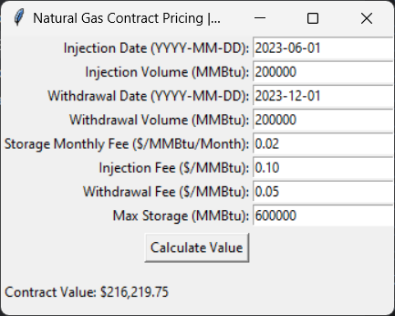

<<<<<<< HEAD
# Natural Gas Storage Contract Pricing Tool

This is a simple desktop application built with Tkinter that allows you to price a natural gas storage contract. The application uses historical natural gas prices and Facebook Prophet for forecasting to calculate the net contract value based on user inputs.



## How It Works

1. **User Inputs**:  
   - **Injection Information**: Enter the date and volume of gas injection.
   - **Withdrawal Information**: Enter the date and volume of gas withdrawal.
   - **Fees & Storage Details**: Input the storage monthly fee, injection fee, withdrawal fee, and maximum storage capacity.
   
2. **Calculation**:  
   When you click on "Calculate Value", the tool uses the `price_contract` logic to:
   - Fetch a price forecast for the provided dates using Prophet.
   - Calculate the costs of injections and withdrawals.
   - Subtract storage fees accrued over time.
   - Compute the net contract value.
   
3. **Output**:  
   The resulting contract value is displayed in the GUI.

## Features

- **User-Friendly GUI**: Built with Tkinter for a simple and intuitive user interface.
- **Forecasting with Prophet**: Uses Facebook Prophet to estimate future natural gas prices based on historical data.
- **Flexible Inputs**: Easily update injection/withdrawal dates, volumes, fees, and storage parameters.
- **Real-Time Calculation**: Displays the computed net contract value immediately after calculation.

## Dependencies

Ensure you have the following dependencies installed:

```bash
pip install prophet pandas
```
Note: Tkinter is included by default with most Python installations.

## Setup and Usage
1. Prepare the Data:
- Place your natural gas price data in a CSV file (e.g., Nat_Gas.csv) in the same folder as the script.
- The CSV file should have at least two columns:
  - Dates: Date values in the format %m/%d/%y (e.g., 06/01/23).
  - Prices: The corresponding natural gas prices.

2. Run the Application:
- Open a terminal or command prompt.
- Navigate to the folder containing the script.
- Execute the script:
```bash
python your_script_name.py
```
- Alternatively, double-click the script file if you are on Windows.

3. Using the GUI:
- Injection Inputs:
  - Enter the injection date (format: YYYY-MM-DD) and the volume (in MMBtu).
- Withdrawal Inputs:
  - Enter the withdrawal date (format: YYYY-MM-DD) and the volume (in MMBtu).
- Fees & Storage:
  - Specify the storage monthly fee (in $/MMBtu/Month), injection fee (in $/MMBtu), withdrawal fee (in $/MMBtu), and the maximum storage capacity (in MMBtu).
- Click the Calculate Value button to see the computed net contract value.

## File Structure
```bash
Natural_Gas_Contract_Pricing/
├── Nat_Gas.csv                # Historical natural gas prices CSV file
├── screenshot
├── .gitattributes
├── PrototypePricingModel.py        # Main Python script with the Tkinter GUI and contract pricing logic
└── README.md                  # This file
```

## Code Overview
1. Data Loading & Prophet Model Training:
- The load_data function reads the CSV file and prepares the data for Prophet. The train_prophet_model function then fits a Prophet model to the historical prices.
2. Contract Pricing Logic:
- The price_contract function calculates the net contract value by processing injection and withdrawal events, estimating prices via Prophet, and deducting fees.
3. Tkinter GUI:
- The ContractPricingApp class defines the GUI elements for user input and displays the output. When the "Calculate Value" button is pressed, it triggers the calculation logic.

## License
- This project is licensed under the MIT License. See the LICENSE file for details.

## Acknowledgments
- Tkinter – The built-in Python GUI framework used for creating the graphical user interface.
- pandas – Used for handling and processing time-series data.
- Prophet – A forecasting tool developed by Meta (Facebook) for time-series prediction, used to estimate natural gas prices.
- logging – Standard Python module used for logging and suppressing unnecessary warnings.
- datetime – Standard Python module used for handling date-time operations.


=======
# GasValuator
>>>>>>> c21d70df1809ad16e14dcffcbc466b41f5834a2d
